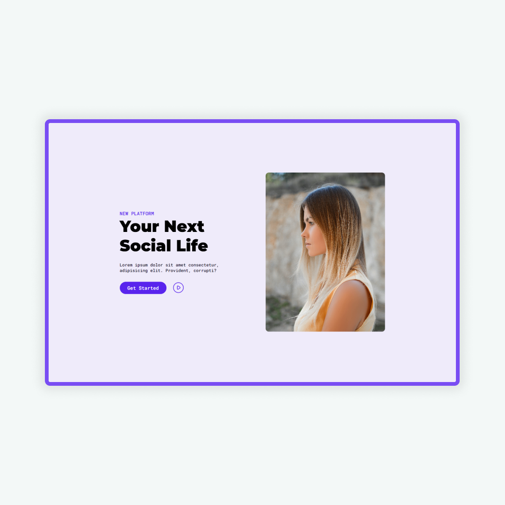

# Project "AMY" (Portfolio Website)

## Watch The Complete Tutorial  : [Playlist](https://www.youtube.com/playlist?list=PLRv_Gd5w9e7m_6DqBDtb1gbG6ikBq2HJ3)

## Live Preview : [Open Link](https://shaifarfan.github.io/AMYs-Portfolio/)

This project is for HTML & CSS practice. AMY is a fictional character. She is a freelance web designer. We made this nice portfolio for her with mainly HTML & CSS. Though we used few lines of js but the main purpose of this project is to practice HTML & CSS.

<b>💻 Coded by [Shaif Arfan](https://instagram.com/shaifarfan08) | [web cifar](https://webcifar.com)</b>

## Similar Projects/turorials

 - [Ayans's Profolio - (react.js project)](https://github.com/ShaifArfan/AYANs-portfolio)
 - [Shaif's Cuisine - (HTML, CSS project)](https://github.com/ShaifArfan/shaif-s-cuisine)
  

